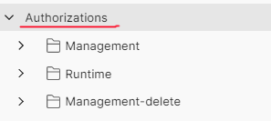
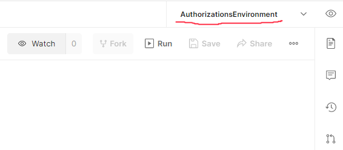

## 01-how-to-apis

This samples shows how to use the management APIs related to API Management Authorizations feature.
It covers six identity providers and the generic provider that can be used for all identity providers that supports the OAuth2.0 standard using authorization code grant.

For each provider an application needs to be created with a redirecturl in this format `https://authorization-manager.consent.azure-apim.net/redirect/apim/[APIM_SERVICENAME]`.  

The first part sets up API Management using Azure CLI/Bicep and create one API with two operations for each provider.
The second part uses Postman and the management APIs to configure authorizations for each provider.

In the Postman collection provided in this sample there is a folder called "Runtime", it consists of requests that can be used to test this feature after it has been setup.

For public preview there are no API documentation so in this sample there is a Postman collection to be used.
These APIs might change before this feature becomes General Available.

The sample will create an API Management instance using the Consumption sku.

#### Requirements
- RBAC Contributor role in subscription. 
- Postman
- For each provider to be used an application needs to be created.

#### Step 1 - Create APIM instance and APIs

1. Login to Azure and make sure it's the right subscription.
```bash
az login
az account show
```
2. Navigate to the "01-how-to-apis" folder and run
```bash
az deployment sub create -l [AZURE_REGION] -n apimdeployment -f main.bicep -p apim_name=[APIM_SERVICENAME] rg_name=[RESOURCEGROUP_NAME] location=[AZURE_REGION]
```
This will create the API Management instance and APIs.

  
#### Step 2 - Configure Postman variables
 
1. Import the Authorizations collection into Postman using the file "authorizations-collection.json".
1. Import the Authorizations environment into Postman using the file "authorizations-environment.json".
1. Open the environment "Authorizations" in Postman.
1. Configure the variables.

There are variables for API Management and then there are variables for each identity provider. The API Management variables are mandatory, only the variables for the providers to be used must be set. 


| Name | Type | Description | Default |
|---|---|---|---|
| token | APIM | Bearer token to be used to authorize against Azure REST API. `az account get-access-token --query accessToken -o tsv`  | | 
| subscriptionId | APIM | SubscriptionID  | |
| resourceGroupName | APIM | Resourcegroup name  | | 
| apimServiceName | APIM | API Manangement name  | |
| apimApiVersion | APIM | API version  | 2021-12-01-preview |
| tenantId | APIM | TenantId in which the API Manangement instance resides. `az account get-access-token --query tenant -o tsv`  |  |
| msi | APIM | The managed system assigned identity of API Management. `az apim show -g rg-apimdev -n apim-authorizations-premium --query identity.principalId -o tsv`   | |
| oid | APIM | User objectId in AAD, this is used to configure access policy for the authorizations. `az ad signed-in-user show --query objectId -o tsv`  | |
| authProviderId | APIM | Name of the authorization provider that will be created, a postman script sets the value for each provider. | |
| authorizationId | APIM | Name of the authorization, this value is being referenced to in the policy used in API Management.  | auth-01 |
| accessPolicyId | APIM | Name of access policy for the msi. | acp-01 |
| accessPolicyId2 | APIM | Name of access policy for the oid.   | acp-02 |
| apimSubscriptionkey | APIM | API Management subscription key to test the runtime requests.   |  |

##### Configuration for AAD - Authorization code grant type

| Name | Type | Description | Default |
|---|---|---|---|
| aadAuthAppClientId | AAD | ClientId for application in AAD. | |
| aadAuthAppClientSecret | AAD | ClientSecret for application in AAD. | |
| aadTenantId | AAD | TenantId for application in AAD. | |

##### Configuration for AAD - Client credentials grant type

| Name | Type | Description | Default |
|---|---|---|---|
| cc-aadAuthAppClientId | AAD-cc | ClientId for application in AAD. | |
| cc-aadAuthAppClientSecret | AAD-cc | ClientSecret for application in AAD. | |
| cc-aadTenantId | AAD-cc | TenantId for application in AAD. | |
| cc-aadobjectId | AAD-cc | ObjectId for user to be searched for during runtime. | |


##### Configuration for Google 

| Name | Type | Description | Default |
|---|---|---|---|
| googleOAuthAppClientId | Google | ApplicationId  | |
| googleOAuthAppClientSecret | Google | ApplicationSecret  | |

##### Configuration for Dropbox 

| Name | Type | Description | Default |
|---|---|---|---|
| dropboxOAuthAppClientId | Dropbox | ApplicationId | |
| dropboxOAuthAppClientSecret | Dropbox | ApplicationSecret | |

##### Configuration for GitHub 

| Name | Type | Description | Default |
|---|---|---|---|
| githubOAuthAppClientId | GitHub | ApplicationId | |
| githubOAuthAppClientSecret | GitHub | ApplicationSecret | |
| githubusername | GitHub | Query parameter used at runtime. | |

##### Configuration for LinkedIn 

| Name | Type | Description | Default |
|---|---|---|---|
| linkedinOAuthAppClientId | LinkedIn | ApplicationId | |
| linkedinOAuthAppClientSecret | LinkedIn | ApplicationSecret | |

##### Configuration for Spotify 

| Name | Type | Description | Default |
|---|---|---|---|
| spotifyOAuthAppClientId | Spotify | ApplicationId | |
| spotifyOAuthAppClientSecret | Spotify | ApplicationSecret | |

##### Configuration for Generic OAuth
Any provider that supports OAuth 2.0 standard with authorization code grant type could be used. This sample used https://www.eventbrite.com/.  

| Name | Type | Description | Default |
|---|---|---|---|
| oauth2OAuthAppClientId | Generic | ApplicationId | |
| oauth2OAuthAppClientSecret | Generic | ApplicationSecret | |
| oauth2TokenUrl | Generic | Url to fetch tokens.  | |
| oauth2RefreshUrl | Generic | Url to refresh tokens. | |
| oauth2AuthUrl | Generic | Url used for authorizationto refresh tokens. | |


#### Step 3 Create authorizations in API Management.

Now it's time to create the authorization configurations in API Management using Postman. 

1. First validate that everything works by starting to list all identity providers.
Choose the imported collection "Authorizations" and make sure the environment "AuthorizationsEnvironment" are chosen.





Navigate to the request Authorizations --> Management --> IdentityProvider --> LIST IdentityProviders and send it. The response should list all available identity providers.

2. Navigate to the folder with the provider to be setup and click on the "Run" button --> "Run Authorizations". 


 
This will send all requests in the folder and create: 
    - authorization provider
    - authorization
    - access policy for managed system identity 
    - access policy for the user with the "oid" objectid

3. Before API Management can fetch tokens a consent is required (this is not the case if client credential grant type is used), this can be done through the Azure portal choosing "Login" in the context menu for the authorization or by sending the request "POST GetLoginLinks". The response contains a link that will start the consent flow. When the consent is done API Management can fetch tokens from the configured identity provider. 
