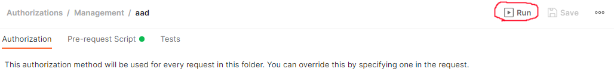

## 01-how-to-apis

This samples shows how to use the Azure REST APIs related to API Management Authorizations feature.
It covers six identity providers and the generic provider that can be used for all identity providers that supports the OAuth 2.0 standard using authorization code grant.

For each provider an application needs to be created with a redirect url in this format `https://authorization-manager.consent.azure-apim.net/redirect/apim/[APIM_SERVICENAME]`.  

The first part sets up API Management using Azure CLI/Bicep and create one API with two operations for each provider and policies to fetch tokens.

The second part uses Postman and the Azure REST APIs to configure API Management Authorizations for each provider.

In the Postman collection provided in this sample there is a folder called "Runtime", it consists of requests that can be used to test this feature after it has been setup.

For public preview of the Authorizations feature there is no Azure REST API documentation. 

This sample consists of a Postman collection (authorizations-collection.json) and a Postman environment (authorizations-environment.json) to be imported.
These APIs might change before this feature becomes General Available (GA).

The sample will create a resource group and an API Management instance using the Developer SKU.

For more information, visit the official [documentation](https://docs.microsoft.com/en-gb/azure/api-management/authorizations-overview) for this feature.

#### Requirements
- Azure CLI
- RBAC Contributor role in subscription. 
- Postman
- For each identity provider to be used an application needs to be created which is not covered in this sample.

#### Step 1 - Create an API Management instance and APIs

1. Login to Azure and make sure it's the right subscription.
```bash
az login
az account show
```
2. Navigate to the "01-how-to-apis" folder and run
```bash
az deployment sub create -l [AZURE_REGION] -n apimdeployment -f main.bicep -p apim_name=[APIM_SERVICENAME] rg_name=[RESOURCEGROUP_NAME] location=[AZURE_REGION]
```
This will create the API Management instance and APIs. 

  
#### Step 2 - Configure Postman variables
 
1. Import the Authorizations collection into Postman using the file "authorizations-collection.json".
1. Import the Authorizations environment into Postman using the file "authorizations-environment.json".
1. Open the environment "Authorizations" in Postman.
1. Configure the variables.

There are variables for API Management and then there are variables for each identity provider. The API Management variables are mandatory, only the variables for the identity providers to be used must be set.


| Name | Type | Description | Default |
|---|---|---|---|
| token | APIM | Bearer token to be used to authorize against Azure REST API. `az account get-access-token --query accessToken -o tsv`  | | 
| subscriptionId | APIM | SubscriptionID  | |
| resourceGroupName | APIM | Resourcegroup name  | | 
| apimServiceName | APIM | API Manangement name  | |
| apimApiVersion | APIM | API version  | 2021-12-01-preview |
| tenantId | APIM | TenantId in which the API Manangement instance resides. `az account get-access-token --query tenant -o tsv`  |  |
| msi | APIM | The managed system assigned identity of API Management. `az apim show -g [resourceGroupName] -n [apimServiceName] --query identity.principalId -o tsv`   | |
| oid | APIM | User objectId in AAD, this is used to configure access policy for the authorizations. `az ad signed-in-user show --query objectId -o tsv`  | |
| authProviderId | APIM | Name of the authorization provider that will be created, a postman script sets the value for each provider. | |
| authorizationId | APIM | Name of the authorization, this value is being referenced to in the policy used in API Management.  | auth-01 |
| accessPolicyId | APIM | Name of access policy for the msi. | acp-01 |
| accessPolicyId2 | APIM | Name of access policy for the oid.   | acp-02 |
| apimSubscriptionkey | APIM | API Management subscription key to test the runtime requests.   |  |
| user_token | APIM | This token is used to for the runtime tests and it's not mandatory to set. When running the "data-jwt" tests this token is attached as a header to the request. `az account get-access-token --resource  https://azure-api.net/authorization-manager --query accessToken -o tsv`     |  |

##### Configuration for AAD - Authorization code grant type

| Name | Type | Description | Default |
|---|---|---|---|
| aadAuthAppClientId | AAD | ClientId for application in AAD. | |
| aadAuthAppClientSecret | AAD | ClientSecret for application in AAD. | |
| aadTenantId | AAD | TenantId for application in AAD. | |

##### Configuration for AAD - Client credentials grant type

| Name | Type | Description | Default |
|---|---|---|---|
| cc-aadAuthAppClientId | AAD-cc | ClientId for application in AAD. | |
| cc-aadAuthAppClientSecret | AAD-cc | ClientSecret for application in AAD. | |
| cc-aadTenantId | AAD-cc | TenantId for application in AAD. | |
| cc-aadobjectId | AAD-cc | ObjectId for user to be searched for during runtime. | |


##### Configuration for Google 

| Name | Type | Description | Default |
|---|---|---|---|
| googleOAuthAppClientId | Google | ApplicationId  | |
| googleOAuthAppClientSecret | Google | ApplicationSecret  | |

##### Configuration for Dropbox 

| Name | Type | Description | Default |
|---|---|---|---|
| dropboxOAuthAppClientId | Dropbox | ApplicationId | |
| dropboxOAuthAppClientSecret | Dropbox | ApplicationSecret | |

##### Configuration for GitHub 

| Name | Type | Description | Default |
|---|---|---|---|
| githubOAuthAppClientId | GitHub | ApplicationId | |
| githubOAuthAppClientSecret | GitHub | ApplicationSecret | |
| githubusername | GitHub | Query parameter used at runtime. | |

##### Configuration for LinkedIn 

| Name | Type | Description | Default |
|---|---|---|---|
| linkedinOAuthAppClientId | LinkedIn | ApplicationId | |
| linkedinOAuthAppClientSecret | LinkedIn | ApplicationSecret | |

##### Configuration for Spotify 

| Name | Type | Description | Default |
|---|---|---|---|
| spotifyOAuthAppClientId | Spotify | ApplicationId | |
| spotifyOAuthAppClientSecret | Spotify | ApplicationSecret | |

##### Configuration for Generic OAuth
Any provider that supports OAuth 2.0 standard with authorization code grant type could be used. This sample used https://www.eventbrite.com/.  

| Name | Type | Description | Default |
|---|---|---|---|
| oauth2OAuthAppClientId | Generic | ApplicationId | |
| oauth2OAuthAppClientSecret | Generic | ApplicationSecret | |
| oauth2TokenUrl | Generic | Url to fetch tokens.  | |
| oauth2RefreshUrl | Generic | Url to refresh tokens. | |
| oauth2AuthUrl | Generic | Url used for authorizationto refresh tokens. | |


#### Step 3 - Create Authorizations in API Management

Now it's time to create the authorization configurations in API Management using Postman.

**Make sure the redirect url is configured for the application for each provider to be used. The redirect url should be https://authorization-manager.consent.azure-apim.net/redirect/apim/[APIM_SERVICENAME]**

1. First validate that everything works by starting to list all identity providers.
Choose the imported collection "Authorizations" and make sure the environment "AuthorizationsEnvironment" are chosen in Postman.

    

    

    Navigate to the request Authorizations --> Management --> IdentityProvider --> LIST IdentityProviders and send it. The response should list all available identity providers.

2. Under Authorizations --> Management, navigate to a folder where the Postman variables are set and click on the button "Run".

    This will send all requests in the folder and create:
    - authorization provider
    - authorization
    - access policy for managed system identity 
    - access policy for the user with the "oid" objectid

    

3. Before API Management can fetch tokens a consent is required (this is not the case if client credential grant type is used), this can be done through the Azure portal choosing "Login" in the context menu for the authorization or by sending the request "POST GetLoginLinks" from Postman. The response contains a link that will start the consent flow. When the consent is done API Management can fetch tokens from the configured identity provider. 

#### Step 4 - Test the APIs


In the Postman collection there is a "Runtime" folder that contains a folder for each identity provider. In each folder there are three requests:
- data - Sends a request to API Management, fetches the access token from the IDP and attaches an Authorization header to the backend service. The access policy that's being used is configured to use the Managed System Identity of API Management. 
- data-jwt - Same as above, except that this request has an HTTP header with the {{user_token}} to be validated against an access policy. 
- token - Sends a request to API Management, fetches the access token from the IDP and returns the token to the client. 
 
     

