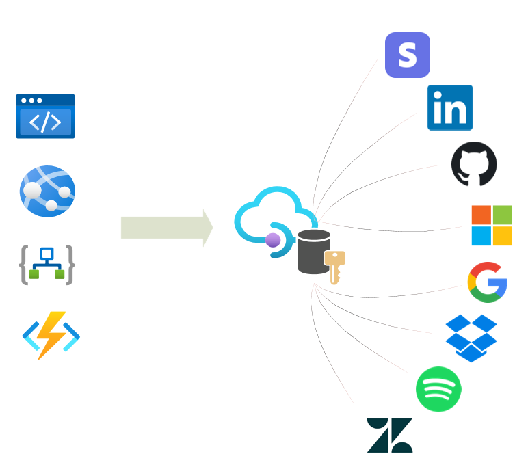

# Azure API Management Authorizations (preview)

This repository consists of samples of how to use the Azure API Management Authorizations feature. 
To get more information please visit the official Azure documentation [here](https://docs.microsoft.com/en-gb/azure/api-management/authorizations-overview). 

 

### Overview 
API Management Authorizations feature simplify the process of managing access tokens when sending requests to APIs secured by an OAuth 2.0 authorization scheme.

By configuring any of the supported identity providers and create an authorization API Management can retrieve access tokens and refresh them when needed based on the expiry of the token lifetime. 
The tokens retrieved can be attached as a header to a backend request in API Management or sent back to a client where the access token can be used.  

### Scenarios
The supported identity providers for public preview are: 
- Azure Active Directory
- Dropbox
- GitHub
- Google
- LinkedIn
- Spotify
- Generic OAuth 2.0 provider
 
With the Generic OAuth 2.0 provider it’s possible to connect to any identity provider that supports authorization code and is following the OAuth 2.0 standard.

This feature is supported for all API Management SKUs. 

Here are some example scenarios where this feature could be used:
- Citizen/low code developers using Power Apps or Power Automate can easily connect to SaaS providers that are using OAuth 2.0.
- Unattended scenarios such as an Azure function using a Timer trigger can utilize this feature to connect to a backend API using OAuth 2.0.
- A marketing team on an enterprise company could use the same authorization for interacting with a social media platform using OAuth 2.0.
- Exposing APIs in API Management as a Logic Apps Custom Connector in Logic Apps where the backend service requires OAuth 2.0 flow.
- On behalf of scenario where a service such as Dropbox can be used by multiple users.
- Connect to different services that requires authorization OAuth 2.0 using GraphQL Federation in API Management.
- Enterprise Application Integration (EAI) patterns using service-to-service authorization can use client credentials grant type against backend APIs that are using OAuth 2.0.
- SPA applications that only want to retrieve an access token to be used in a client SDKs against an API using OAuth 2.0.